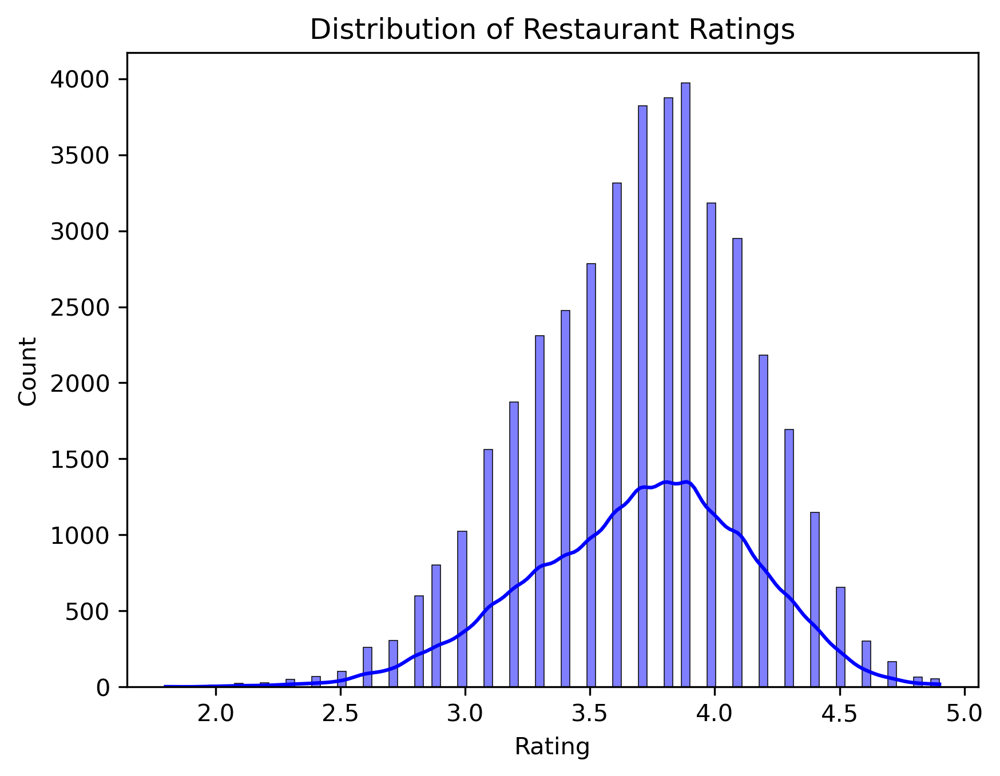
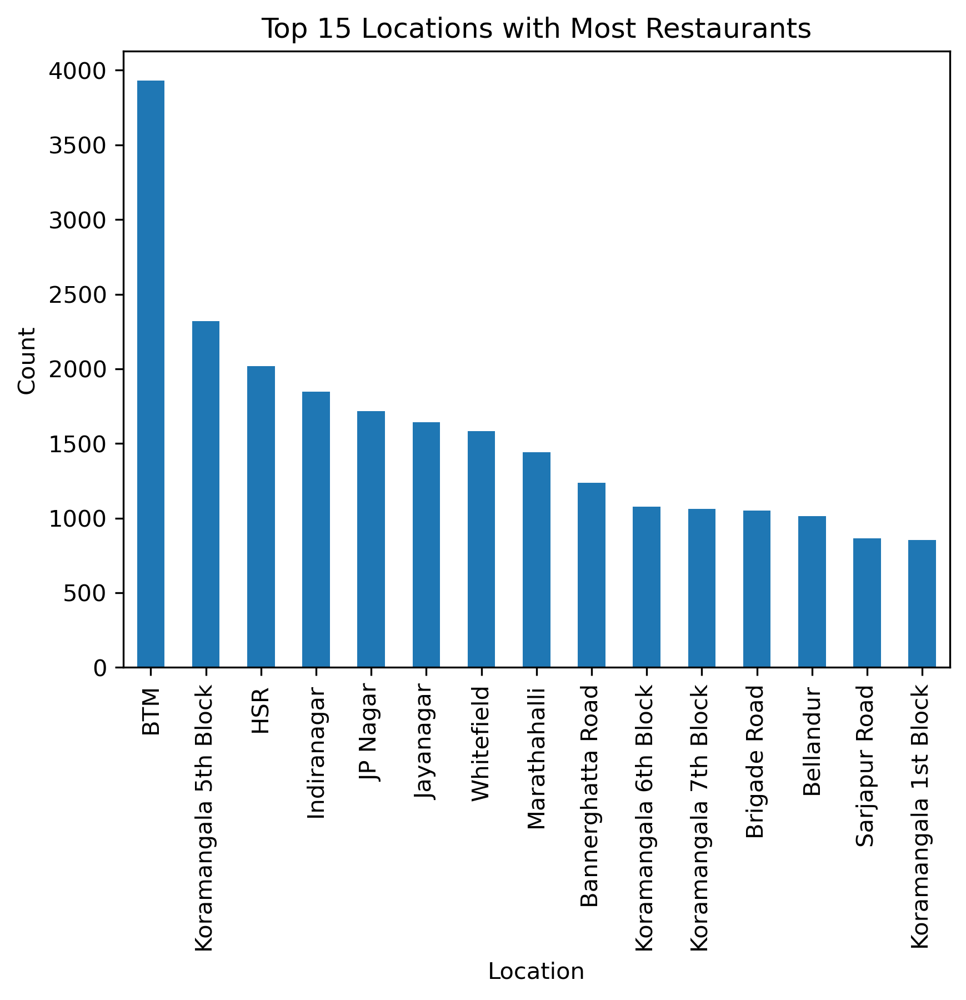
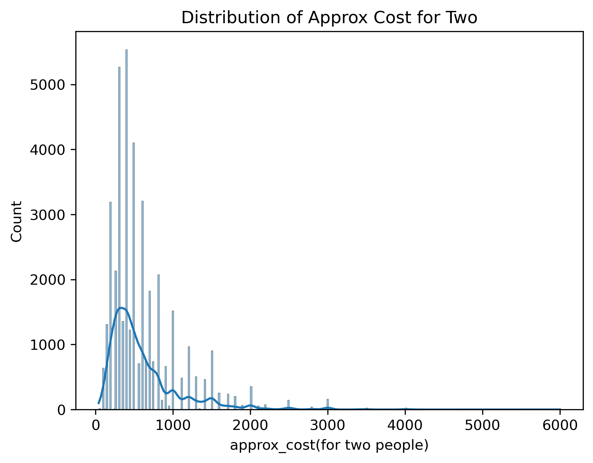
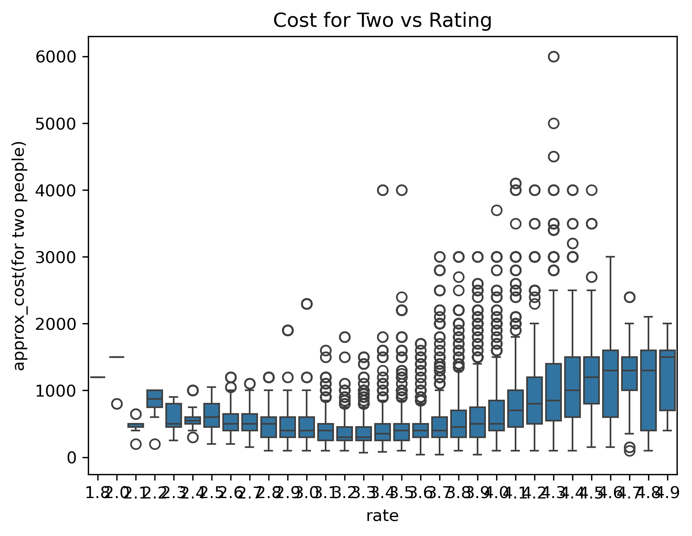
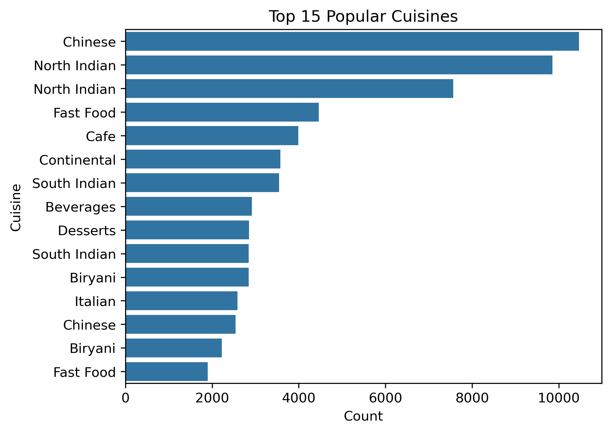
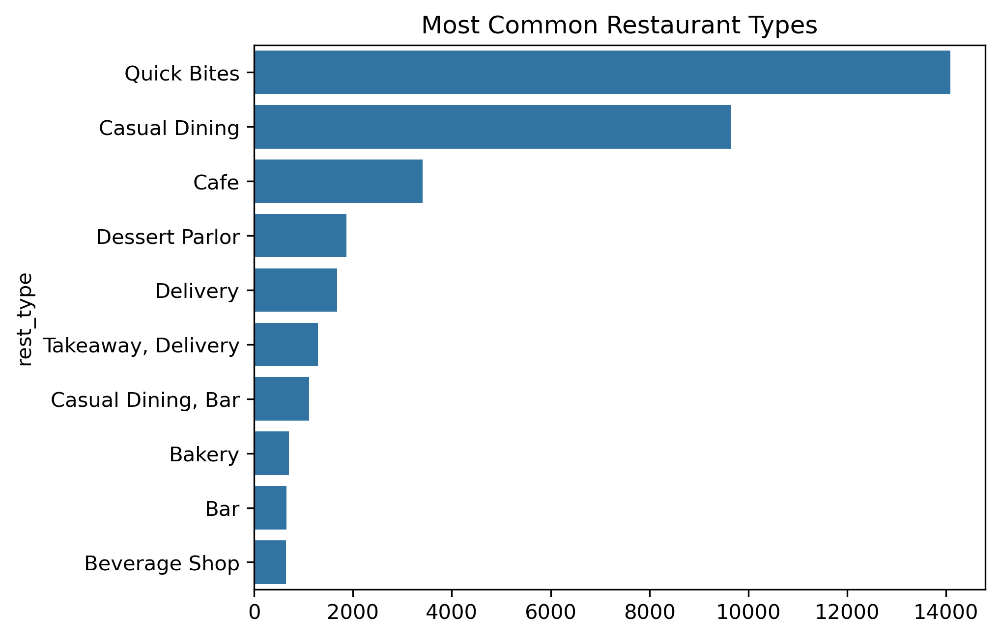
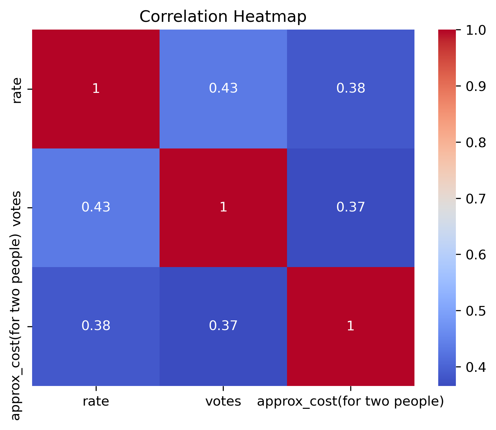
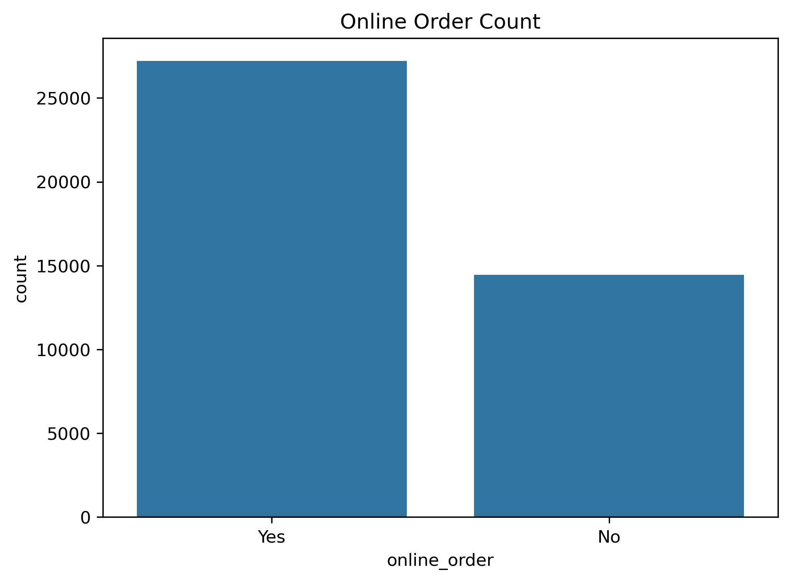

# zomato-eda-analysis
Exploratory Data Analysis on the Zomato Bangalore Restaurants Dataset using Python, Pandas, NumPy, Matplotlib, and Seaborn. Includes data cleaning, visualization, and business insights on cuisines, ratings, cost, locations, and customer behavior.

# 🍽️ Zomato Restaurants Data Analysis – Exploratory Data Analysis (EDA)

 **📌 Project Overview**
This project performs an in-depth Exploratory Data Analysis (EDA) on the Zomato Bangalore Restaurants dataset to uncover insights on customer preferences, cuisine trends, prices, ratings, and restaurant behavior.

Tools used: **Python, Pandas, NumPy, Matplotlib, Seaborn,Jupyter Notebook**

## 📂 Dataset
Source: Kaggle  
Dataset Link: https://www.kaggle.com/datasets/himanshupoddar/zomato-bangalore-restaurants

The dataset contains:  
- 51,717 restaurant records  
- 17 features (ratings, votes, cuisines, location, cost, online order, table booking, etc.)

## 🧹 Data Cleaning Performed
- Removed duplicates (11,000+ rows)
- Dropped irrelevant columns (url, phone, menu_item, etc.)
- Cleaned "rate" column (removed `/5`, replaced NEW / "-" with NaN)
- Converted cost column to numeric
- Filled missing values for location, cuisines, rest_type
- Standardized inconsistent data entries

---

## 📊 Visual Explorations

### ⭐ Rating Distribution

---

### ⭐ Online Order vs Rating

---

### ⭐ Table Booking vs Rating

---

### ⭐ Top 15 Restaurant Locations

---

### ⭐ Cost for Two – Distribution

---

### ⭐ Cost vs Rating

---

### ⭐ Top Cuisines

---

### ⭐ Restaurant Type Distribution

---

### ⭐ Correlation Heatmap

---

### ⭐ Online Order Count

---

## 🧠 Key Insights

1. **Online-order restaurants have higher ratings**, indicating customer preference for delivery.
2. **North Indian, Chinese, and South Indian** are the most dominant cuisines.
3. **Koramangala, Indiranagar, JP Nagar** are the top food hubs of Bangalore.
4. Restaurants priced **₹300–₹800** are the most common.
5. Restaurants offering **table booking** tend to have higher ratings (premium dining).
6. Higher-priced restaurants show **slightly better ratings**, but correlation is weak.

---

## 📌 Business Recommendations

- Promote online delivery in high-demand areas.
- Improve service quality in low-rated but high-density areas.
- Encourage premium restaurants to enable table booking.
- Expand multi-cuisine menus due to high popularity.
- Target marketing in Koramangala & Indiranagar (top-performing areas).

---

## 🛠️ Tech Stack
- **Python**
- **Pandas**
- **NumPy**
- **Matplotlib**
- **Seaborn**

---

## 👩‍💻 Author
Sahithi Kasturi 

